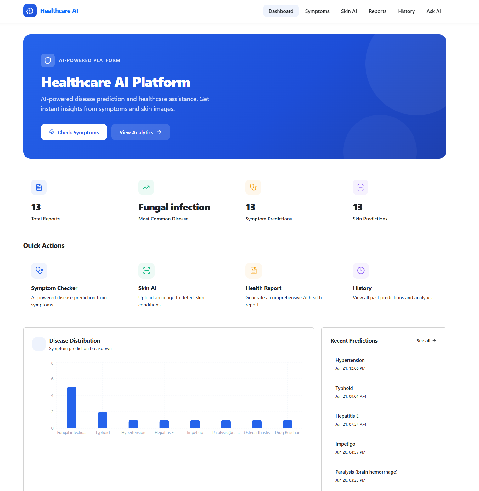
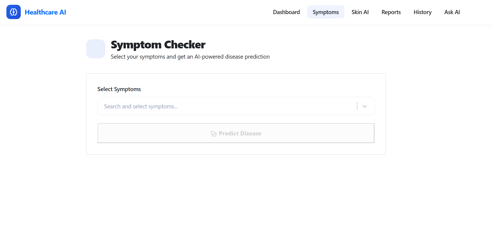
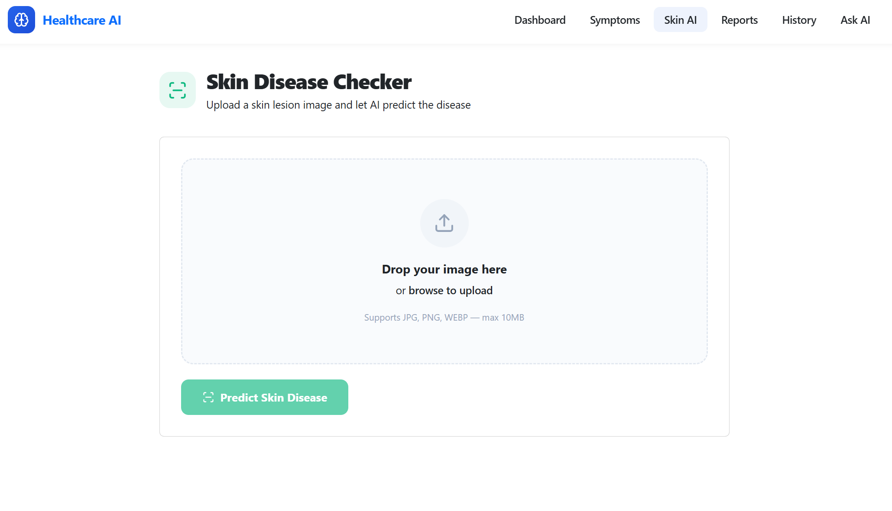
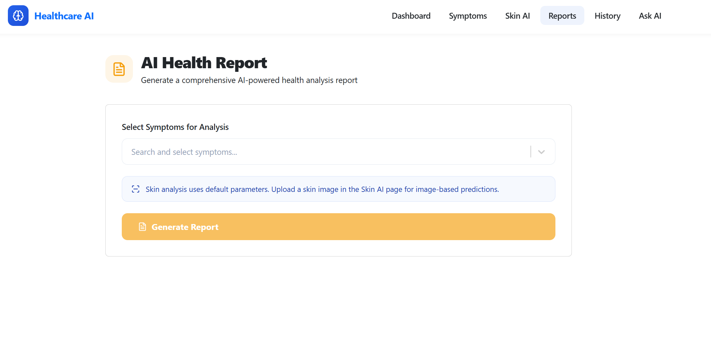
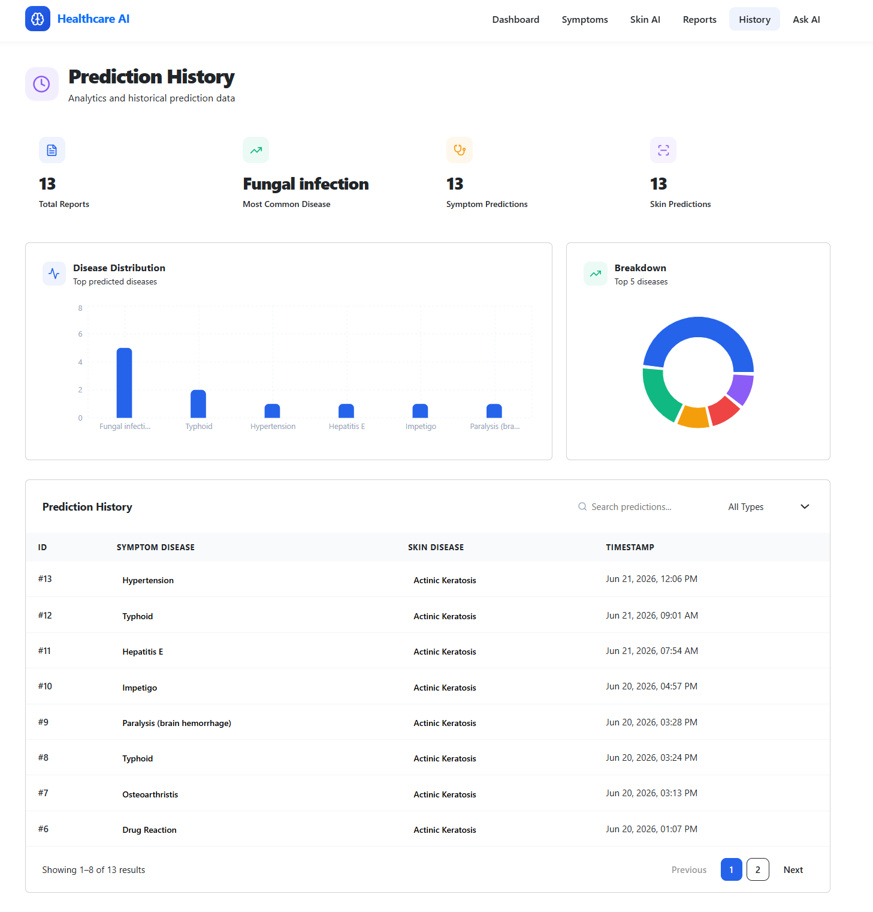
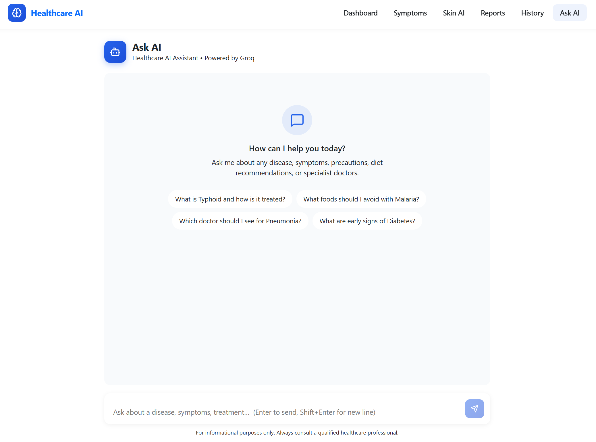
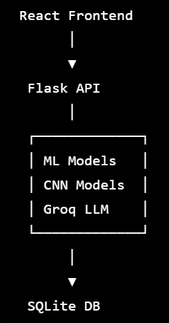

# 🏥 Healthcare AI Platform

An AI-powered healthcare assistant that combines:

- Symptom-based disease prediction
- Skin disease image analysis
- AI-generated health reports
- Medical prediction history tracking
- Interactive AI chatbot powered by Groq LLM

The platform helps users receive preliminary healthcare insights through machine learning and AI technologies.

---

# 📌 Features

## 1. Symptom Disease Prediction

Users can select multiple symptoms from a dynamic dropdown.

The system predicts:

- Disease Name
- Confidence Score
- Risk Level
- Recommended Doctor

### Technologies Used

- Scikit-Learn
- Pickle Models
- Flask API
- React Frontend

---

## 2. Skin Disease Detection

Users upload an image of a skin lesion.

The system predicts:

- Skin Disease
- Disease Code
- Confidence Score

### Technologies Used

- TensorFlow
- CNN Model
- PIL
- NumPy

---

## 3. AI Health Report

Combines:

- Symptom Prediction
- Skin Disease Prediction
- AI Explanation

Generates:

- Detailed Healthcare Report
- Professional PDF Report Download

### Features

- Disease Summary
- Risk Assessment
- Medical Recommendations
- Downloadable PDF

---

## 4. Prediction Dashboard

Displays:

- Total Reports
- Most Common Disease
- Disease Distribution Charts
- Recent Predictions

### Visualization

- Recharts
- Interactive Graphs
- Statistics Dashboard

---

## 5. Prediction History

Stores all predictions in SQLite database.

Features:

- Search Predictions
- Filter Records
- Analytics
- Historical Reports

---

## 6. AI Medical Assistant

Powered by:

- Groq API
- Llama 3 Large Language Model

Allows users to:

- Ask disease-related questions
- Understand symptoms
- Get health guidance
- Learn treatment options

⚠️ The chatbot is for informational purposes only and does not replace professional medical advice.

---

# 🧠 AI Models Used

## Symptom Prediction Model

Machine Learning Model trained on:

- Symptom-Disease Dataset

Outputs:

- Disease Name
- Confidence
- Risk Level

---

## Skin Disease Detection Model

Deep Learning CNN Model trained on:

- Skin Disease Image Dataset

Outputs:

- Disease Classification
- Confidence Score

---

## AI Chatbot

Provider:

- Groq

Model:

- Llama 3

Purpose:

- Healthcare Question Answering
- Disease Explanation
- Medical Information Assistance

---

# 🏗️ Project Architecture

```
React Frontend
      │
      ▼
 Flask Backend API
      │
 ┌───────────────┐
 │ ML Models     │
 │ CNN Models    │
 │ Groq LLM      │
 └───────────────┘
      │
      ▼
 SQLite Database
```

---

# ⚙️ Tech Stack

## Frontend

- React.js
- React Router DOM
- React Select
- Lucide React
- Recharts
- jsPDF
- CSS

---

## Backend

- Flask
- Flask-CORS
- SQLite
- TensorFlow
- NumPy
- Pandas
- Pillow
- Groq SDK

---

## Database

- SQLite

---

## AI / ML

- Scikit-Learn
- TensorFlow
- CNN
- Groq LLM

---

# 📂 Project Structure

```
Healthcare_AI/
│
├── backend/
│   ├── app.py
│   ├── database.py
│   ├── llm_service.py
│   ├── .env
│
├── frontend/
│   ├── src/
│   ├── public/
│   ├── package.json
│   ├── vite.config.js
│
├── models/
│   ├── symptom_model.pkl
│   ├── symptom_encoder.pkl
│   ├── skin_model.h5
│
├── healthcare.db
│
├── README.md
└── requirements.txt
```

---

# 🔑 Environment Variables

Create:

```
backend/.env
```

Add:

```env
GROQ_API_KEY=your_groq_api_key
```

---

# 📸 Application Screenshots

## Dashboard



---

## Symptom Disease Prediction



---

## Skin Disease Detection



---

## AI Health Report



---

## Prediction History



---

## AI Healthcare Assistant



# 🏗️ System Architecture




# 🚀 Installation

## 1. Clone Repository

```bash
git clone https://github.com/yourusername/Healthcare_AI.git
cd Healthcare_AI
```

---

## 2. Create Virtual Environment

```bash
python -m venv venv
```

Activate:

### Windows

```bash
venv\Scripts\activate
```

### Linux / Mac

```bash
source venv/bin/activate
```

---

## 3. Install Backend Dependencies

```bash
pip install -r requirements.txt
```

---

## 4. Install Frontend Dependencies

```bash
cd frontend

npm install

npm install react-select
npm install jspdf
npm install lucide-react
npm install recharts
```

---

## 5. Configure Groq API

Create:

```env
backend/.env
```

Add:

```env
GROQ_API_KEY=your_groq_api_key
```

---

# ▶️ Running the Project

## Start Backend

```bash
cd backend

python app.py
```

Backend:

```
http://127.0.0.1:5000
```

---

## Start Frontend

Open new terminal:

```bash
cd frontend

npm run dev
```

Frontend:

```
http://localhost:5173
```

## Dataset

The training dataset is not included in this repository because of its large size (~3.36 GB).

Place the dataset inside:

```text
datasets/
```

before retraining the models.

The repository already includes the trained model files required to run predictions.

---

# 📊 API Endpoints

## Symptom Prediction

```
POST /predict
```

---

## Skin Disease Prediction

```
POST /predict_skin_image
```

---

## Health Report

```
POST /health_report
```

---

## AI Chatbot

```
POST /chat
```

---

## History

```
GET /history
```

---

## Dashboard Statistics

```
GET /stats
```

---

# 📈 Future Enhancements

- Real Doctor Recommendation System
- Multi-language Support
- Voice Assistant
- Medical Report OCR
- Appointment Booking
- Cloud Deployment
- User Authentication
- Patient Profile Management

---

# ⚠️ Disclaimer

This project is developed for educational and research purposes.

The predictions generated by the AI models are not medical diagnoses.

Always consult a qualified healthcare professional for medical advice, diagnosis, and treatment.

---

# 👨‍💻 Author

**Rizu Banerjee**

B.Tech Student

AI | Machine Learning | Healthcare Technology

---

# ⭐ Acknowledgements

- TensorFlow
- Scikit-Learn
- React
- Flask
- Groq
- Open Source Healthcare Datasets
